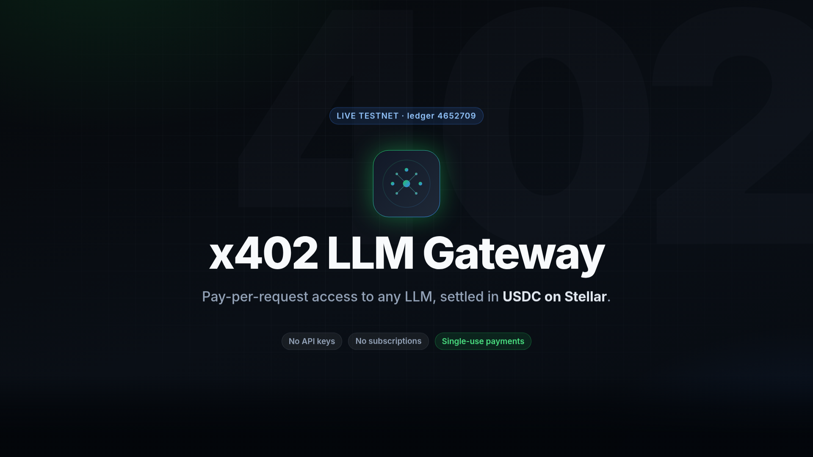

<p align="center">
  
</p>

<h1 align="center">x402 LLM Gateway</h1>

<p align="center">
  <strong>Pay-per-request LLM gateway with stablecoin micropayments on Stellar.</strong>
  <br />
  No API keys. No subscriptions. Minimal rate limits.
  <br />
  Just pay USDC on-chain and access any LLM endpoint.
</p>

<p align="center">
  <a href="#-demo"><strong>🎬 Demo</strong></a> ·
  <a href="#-architecture"><strong>Architecture</strong></a> ·
  <a href="#-quickstart"><strong>Quickstart</strong></a> ·
  <a href="#-api-reference"><strong>API</strong></a> ·
  <a href="#-client-sdk"><strong>SDK</strong></a> ·
  <a href="#-smart-contracts"><strong>Contracts</strong></a> ·
  <a href="#-deployment"><strong>Deploy</strong></a>
</p>

<p align="center">
  <a href="docs/media/x402-gateway-demo.mp4"
    ></a>
  
  
  
  
  
</p>

> ### ⚠️ Network status: **Testnet only** — not mainnet-ready
>
> Payments use **testnet USDC with no real value**. A Stellar mainnet launch
> is gated by the items in **[`MAINNET_READINESS.md`](./MAINNET_READINESS.md)** —
> most critically an **independent contract audit** (the Soroban contracts
> are self-tested; no external audit has been completed) and a fresh
> **mainnet contract deployment**.

### Status at a glance

Read this before citing anything below as shipped. The columns are strict:

- **Implemented** — the code exists and is covered by the test suite.
- **Testnet verified** — exercised end-to-end against **live Stellar Testnet**,
  with on-chain evidence anyone can check independently.
- **Publicly deployed** — reachable on the public internet _right now_.
- **Production ready** — operated, monitored and hardened for real money.
- **Mainnet ready** — the [`MAINNET_READINESS.md`](./MAINNET_READINESS.md) gate
  is satisfied.

| Component                    | Implemented | Testnet verified | Publicly deployed | Production ready | Mainnet ready |
| ---------------------------- | :---------: | :--------------: | :---------------: | :--------------: | :-----------: |
| Gateway API (NestJS)         |     ✅      |        ✅        |        ❌         |        ❌        |      ❌       |
| Provider dashboard (Next.js) |     ✅      |        ✅        |  ⚠️ stale build   |        ❌        |      ❌       |
| Payment verification (x402)  |     ✅      |        ✅        |        ❌         |        ❌        |      ❌       |
| `credit-escrow` contract     |     ✅      |        ✅        |  ✅ testnet only  |        ❌        |      ❌       |
| `payment-verifier` contract  |     ✅      |        ✅        |  ✅ testnet only  |        ❌        |      ❌       |
| `multisig` contract          |     ✅      |        ✅        |  ✅ testnet only  |        ❌        |      ❌       |
| TypeScript SDK               |     ✅      |        ✅        |   n/a (library)   |        ❌        |      ❌       |
| Python / LangChain SDK       |     ✅      |        ⚠️        |   n/a (library)   |        ❌        |      ❌       |
| Multisig payout automation   |     ✅      |        ✅        |        ❌         |        ❌        |      ❌       |
| Escrow settlement (metered)  |     ✅      |        ✅        |        ❌         |        ❌        |      ❌       |
| Webhook + in-app delivery    |     ✅      |        ⚠️        |        ❌         |        ❌        |      ❌       |

**In plain terms:** everything is built and Testnet-verified; **nothing is
running in production**, and the project is **not mainnet-ready**.

The caveats behind the remaining ⚠️ marks, because they matter for a fair reading:

- **The dashboard is publicly reachable but not correct.** The deployment at
  `pay-per-token-llm-gateway-dashboard.vercel.app` is a stale build that still
  calls `http://localhost:3000`; with no gateway deployed it renders a
  configuration error rather than data. The client-side fix is in `main` but has
  not been redeployed, and **no gateway is hosted anywhere**, so the URL is not a
  working demo. Treat the demo video as the demonstration of the product.
- **Library and delivery rows are marked ⚠️ on Testnet verification** where this
  repository's evidence does not cover them end-to-end (the Python SDK is tested
  against mocks, not live Testnet; webhook and in-app delivery are exercised in
  unit tests, and no webhook has been delivered to a real external receiver).
- **There is no email channel.** The nodemailer handler was removed rather than
  left half-wired: it was never registered in the dispatcher, its `EMAIL_*`/
  `SMTP_*` config was inert and no recipient model existed. In-app notifications
  are persisted in Postgres and served from `/api/v1/notifications`; webhooks are
  HMAC-signed and SSRF-guarded. See [`MAINNET_READINESS.md`](./MAINNET_READINESS.md) §5.
- **Escrow settlement is now Testnet-verified.** A per-token route charges the
  metered cost and refunds the unused surplus on-chain: `bash
scripts/testnet-escrow.sh` deploys a fresh `credit-escrow`, has a user deposit
  USDC, drives a per-token request through the real gateway, and asserts the
  charge and refund against the ledger. Both transactions are confirmed on
  Horizon (see [`docs/VERIFICATION.md`](./docs/VERIFICATION.md) §6). Both
  transactions are persisted to the `Payment` row (`settlementTxHash`,
  `refundTxHash`), so a settlement is auditable from the database.

**Not started / planned** (tracked as issues, do not present as done):
multi-provider load balancing ([#3](https://github.com/mallonepay/pay-per-token-llm-gateway/issues/3)),
an independent Soroban audit ([#83](https://github.com/mallonepay/pay-per-token-llm-gateway/issues/83)),
and the project-naming decision ([#84](https://github.com/mallonepay/pay-per-token-llm-gateway/issues/84)).

**[`docs/VERIFICATION.md`](./docs/VERIFICATION.md) is the authoritative account of
what has actually been verified** — the exact commands, the real Testnet
transaction hashes, and an explicit section listing what is _not_ verified.
Start there before citing anything in this file.

Machine-readable receipts live in [`docs/evidence/`](./docs/evidence):
`testnet-journey.json` (a real USDC payment, its replay and forged-payment
rejections, the multisig payout, and the credit-escrow charge/refund),
`dashboard-e2e.json` (every dashboard data source returning real rows) and
`failure-injection.json` (what every surface returns with PostgreSQL, Redis or
Soroban RPC down). Reproduce them with `bash scripts/testnet-journey.sh`,
`bash scripts/testnet-escrow.sh`, `bash scripts/dashboard-e2e.sh` and
`bash scripts/failure-injection.sh`.

---

## 🎬 Demo

<p align="center">
  <a href="docs/media/x402-gateway-demo.mp4">
    
  </a>
  <br />
  <sub
    >▶︎ <b>Watch the 5-minute product demo</b> — 1080p MP4 ·
    <a href="docs/media/x402-gateway-demo.srt">captions (.srt)</a></sub
  >
</p>

Five minutes (4:49), start to finish: the problem, the HTTP 402 protocol, a **real
Stellar testnet payment** that returns a successful paid response, single-use
replay enforcement, the provider dashboard, and the architecture behind it.

| Timestamp | Chapter                     | What you see                                                                |
| --------- | --------------------------- | --------------------------------------------------------------------------- |
| `0:00`    | Cold open                   | Pay-per-request AI, settled on Stellar                                      |
| `0:09`    | The problem                 | Keys, subscriptions and duplicated billing                                  |
| `0:33`    | The protocol                | `402 Payment Required`, and a live quote response                           |
| `0:57`    | How it works                | The five-step money path, animated                                          |
| `1:38`    | **Live on Stellar testnet** | A real USDC payment, a paid `200` + receipt, then replay + forged rejection |
| `2:30`    | The product                 | Provider dashboard: analytics, routes, payments, audit, escrow              |
| `2:58`    | Architecture & code         | Monorepo, three-layer replay protection, Soroban + TypeScript source        |
| `3:39`    | Differentiation             | Why Stellar's cost and finality make sub-cent payments viable               |
| `4:09`    | Engineering & audit status  | CI gates, security scans, and the honest mainnet gate                       |
| `4:32`    | Close                       | Quickstart and repo                                                         |

> **Everything on screen was captured from a running stack.** The dashboard
> screenshots come from a live gateway with Postgres and Redis, and the
> on-chain evidence is a real testnet transaction —
> [`0d9f98e9…f2da18b0`](https://stellar.expert/explorer/testnet/tx/0d9f98e9fed64409e7abfe471445d257802010603237b287bf2b9ad5f2da18b0),
> ledger 4,652,709 — whose paid retry returned `HTTP 200` with a payment
> receipt. Dashboard figures use a seeded demo dataset; see
> [`video/README.md`](./video/README.md#provenance--what-is-real-and-what-is-demo-data)
> for the full provenance table.

<sub>
Reproduce it, or re-record the narration:
<a href="./video/README.md"><code>video/README.md</code></a> ·
<code>node video/render.mjs</code> (silent cut) ·
<code>node video/make-voiceover.mjs --out docs/media/x402-gateway-demo.mp4</code>
voices the featured file in place (ElevenLabs / OpenAI / Cartesia / Gemini, or
local piper with no API key)
</sub>

---

## What is x402?

**x402** extends the HTTP 402 Payment Required status code into a real protocol for AI API access. Instead of managing API keys, rate limits, and billing systems, you pay for each request with stablecoins on the Stellar blockchain.

The gateway acts as a reverse proxy that:

1. **Receives** an LLM API request (OpenAI-compatible format)
2. **Returns HTTP 402** with a Stellar payment address and price quote
3. **Verifies** the on-chain payment via Horizon
4. **Forwards** the request to the upstream LLM
5. **Returns** the LLM response with a payment receipt

This enables **permissionless AI access** — anyone with a Stellar wallet can use LLMs without signing up, providing payment details, or managing API keys.

### Why Stellar?

| Feature                     | Benefit                                              |
| --------------------------- | ---------------------------------------------------- |
| **$0.00001 fees**           | Economical for micropayments as small as $0.001      |
| **5-second finality**       | Near-instant payment confirmation                    |
| **USDC native**             | Stablecoin support without bridges or wrapped tokens |
| **Soroban smart contracts** | On-chain verification, escrow, and multisig payouts  |
| **Horizon API**             | Simple REST API for querying transactions            |

---

## 🌐 Architecture

```
                        HTTP 402 + Quote
   ┌──────────────┐ ◄──────────────────── ┌──────────────────────┐
   │              │                        │                      │
   │   Caller     │ ──── Pay USDC ───────► │   x402 Gateway       │
   │  (Agent/App) │                        │   (NestJS)           │
   │              │ ◄─── LLM Response ──── │                      │
   └──────────────┘                        └──────────┬───────────┘
                                             │        │
                                    ┌────────┘        └─────────┐
                                    ▼                            ▼
                           ┌──────────────┐          ┌──────────────────┐
                           │   Stellar    │          │   Upstream LLM   │
                           │   Horizon /  │          │   OpenAI, etc.   │
                           │   Soroban    │          │                  │
                           └──────┬───────┘          └──────────────────┘
                                  │
                                  ▼
                           ┌──────────────┐
                           │   Provider   │
                           │   Dashboard  │
                           │   (Next.js)  │
                           └──────────────┘
```

### Detailed Flow

```
Caller                Gateway                 Stellar              Upstream LLM
  │                      │                       │                      │
  │── POST /chat ───────►│                       │                      │
  │                      │                       │                      │
  │◄─ 402 {quote} ───────│                       │                      │
  │                      │                       │                      │
  │───── Payment ────────│──────────────────────►│                      │
  │                      │                       │── confirm ──────────►│
  │                      │◄── tx_recorded ───────│                      │
  │                      │                       │                      │
  │── POST + txHash ────►│                       │                      │
  │                      │── verify tx ─────────►│                      │
  │                      │◄── tx_valid ──────────│                      │
  │                      │                       │                      │
  │                      │────────────────────────────── forward ──────►│
  │                      │◄───────────────────────────── response ──────│
  │◄─ LLM response ──────│                       │                      │
```

---

## ✨ Features

### Core Gateway

- **HTTP 402 Payment Required** — Standards-compliant payment flow
- **OpenAI-compatible API** — Drop-in replacement for `/v1/chat/completions`
- **Streaming (SSE) support** — Real-time token streaming to clients
- **Single-use payments** — Each transaction hash is consumed atomically (DB claim + Redis + on-chain guards); double-use is rejected
- **Underpayment enforcement** — Per-token debt ledger gates future access until a top-up payment clears it
- **Rate limiting** — Per-route limits for unpaid requests (per IP); confirmed payments unlock a higher tier keyed by the server-verified payer wallet
- **Multi-provider** — Host multiple LLM providers behind one gateway
- **Per-route configuration** — Different pricing, models, and upstream URLs per route

### 💰 Pricing Models

| Model         | How It Works                                  | Use Case                                |
| ------------- | --------------------------------------------- | --------------------------------------- |
| **Flat-rate** | Fixed price per request                       | Standard API access, known costs        |
| **Per-token** | Pay per token consumed (`usage.total_tokens`) | Variable-length responses, fair billing |

For per-token pricing, the client sends a deposit (estimated from `max_tokens`, or a default token budget when omitted) and the gateway caps forwarded completions to that budget. After the response it calculates the actual cost from `usage.total_tokens` and reports the surplus/underpayment via headers. Underpayments are recorded as **open debt per payer**: future requests from that payer are refused with a 402 top-up quote covering deposit + debt until one payment clears the ledger (see [MAINNET_READINESS.md](./MAINNET_READINESS.md)).

### 📊 Dashboard (Next.js)

- Real-time revenue and request analytics
- Route and provider CRUD management
- Payment history with filtering and pagination
- Audit log of all gateway operations
- Wallet-based authentication (Freighter, xBull, Albedo)
- Webhook configuration and testing

### 🔗 Client SDK

- TypeScript/JavaScript SDK with automatic 402 → pay → retry flow
- Streaming support via async generators
- Stellar wallet integration (secret key or external signer)
- Payment confirmation polling with configurable timeout
- Lightweight — depends only on `stellar-sdk` and `fetch`

### 📡 Notifications

- Webhook delivery with retry logic and optional HMAC-SHA256 signed payloads
- In-app notifications **persisted in PostgreSQL** and surfaced in the dashboard (`/notifications`), with per-item and bulk read state
- Event types: `payment_received`, `verification_failed`, `request_forwarded`
- Extensible notification channel system

---

## 📁 Monorepo Structure

```
x402-llm-gateway/
├── apps/
│   ├── gateway/              # NestJS reverse proxy server
│   │   └── src/
│   │       ├── modules/
│   │       │   ├── proxy/        # HTTP proxy with 402 flow
│   │       │   ├── x402/         # Quote generation, payment verification
│   │       │   ├── payments/     # Payment records and status
│   │       │   ├── routes/       # Route configuration CRUD
│   │       │   ├── providers/    # Provider management
│   │       │   ├── analytics/    # Usage and revenue analytics
│   │       │   ├── admin/        # Audit logs and admin operations
│   │       │   ├── webhooks/     # Webhook delivery
│   │       │   └── auth/         # Wallet-based authentication
│   │       ├── common/           # Guards, filters, shared modules
│   │       └── e2e/              # End-to-end tests
│   └── dashboard/            # Next.js provider dashboard
│       └── src/
│           ├── app/              # Pages (routes, payments, settings, etc.)
│           ├── components/       # UI components (sidebar, navbar, providers)
│           └── lib/              # API client, hooks, auth utilities
│
├── contracts/                # Soroban smart contracts (Rust)
│   ├── payment-verifier/     # On-chain payment recording
│   ├── credit-escrow/        # Prepaid credit balances
│   └── multisig/             # Provider payout wallet security
│
├── packages/                 # Shared libraries (published as @x402/*)
│   ├── types/                # TypeScript type definitions
│   ├── x402-core/            # Quote generation, payment verification, replay protection
│   ├── sdk/                  # Client SDK (402 → pay → retry)
│   ├── config/               # Centralized configuration with env validation
│   ├── logger/               # Structured logging (text + JSON modes)
│   ├── validation/           # Zod schemas for request validation
│   ├── database/             # Prisma client, schema, and migrations
│   ├── wallet/               # Stellar wallet utilities (tx building, Horizon)
│   ├── authentication/       # Wallet challenge-response auth
│   ├── analytics/            # Usage & revenue analytics service
│   ├── notifications/        # Webhook + in-app notification delivery
│   ├── shared/               # General utilities (ID generation, timestamps)
│   └── ui/                   # Shared UI utilities
│
├── infrastructure/
│   └── docker/               # Dockerfiles (gateway, dashboard) + compose
│
├── .github/workflows/
│   ├── ci.yml                # Lint → Test → Build (with PostgreSQL + Redis services)
│   └── deploy.yml            # Docker push + Soroban contract deployment (tag-triggered)
│
└── docs/                     # Documentation assets
    ├── dashboards/            # Grafana dashboard JSON
    ├── evidence/              # Reproducible testnet-journey evidence
    └── media/                 # Demo video, captions, thumbnail

# Top-level documentation (not under docs/)
#   README.md · ARCHITECTURE.md · API.md · DEPLOYMENT.md · OPERATIONS.md
#   OBSERVABILITY.md · SECURITY.md · CONTRIBUTING.md · THREAT-MODEL.md
#   MAINNET_READINESS.md · AUDIT.md · GAS-OPTIMIZATION.md
```

### Database Schema

| Model              | Purpose                                                     |
| ------------------ | ----------------------------------------------------------- |
| `Provider`         | LLM provider/merchant with Stellar wallet                   |
| `Route`            | Protected endpoint → upstream mapping with pricing          |
| `Payment`          | Payment records with on-chain verification data             |
| `UnderpaymentDebt` | Open per-payer deficits from metered per-token underpayment |
| `PayoutProposal`   | Multisig payout proposals and their approval state          |
| `Notification`     | Persisted notification records (incl. durable in-app feed)  |
| `AnalyticsEvent`   | Request and payment events for analytics                    |
| `AuditLog`         | Immutable audit trail of all operations                     |

---

## 🚀 Quickstart

### Prerequisites

- **Node.js** ≥ 20
- **pnpm** ≥ 9
- **PostgreSQL** ≥ 16
- **Redis** ≥ 7
- **Rust** (optional — only needed for Soroban contracts)

### 1. Clone and Install

```bash
git clone https://github.com/mallonepay/pay-per-token-llm-gateway.git
cd pay-per-token-llm-gateway

pnpm install
pnpm nx run database:generate

# 1. Copy the example environment file
cp .env.example .env

# 2. Generate a real JWT_SECRET and paste it into .env
openssl rand -base64 32
# ⚠️  The gateway refuses to start with a missing or placeholder JWT_SECRET.
```

The gateway **auto-loads `.env` from the repository root on startup** — no manual `export` is required. See [Environment Files](#environment-files).

### 2. Start Infrastructure

```bash
pnpm infra:up
```

Starts **only Postgres + Redis**, which is what the from-source flow in steps 4
and 5 needs — leaving ports 3000 and 3001 free for `pnpm dev:gateway` and
`pnpm dev:dashboard`.

> `--env-file .env` is required, and the scripts above pass it. Compose looks
> for `.env` next to the **compose file** (`infrastructure/docker/`), not the
> repository root, so a bare `docker compose -f infrastructure/docker/docker-compose.yml up`
> cannot see the root `.env` and aborts on the required `JWT_SECRET` — starting
> nothing at all, Postgres and Redis included.

#### Two ways to run the app, and why they can't collide

The gateway/dashboard containers live behind the Compose **`stack` profile**, so
the two flows are separated at the command level:

| Flow                                | Command                                                     | Owns            |
| ----------------------------------- | ----------------------------------------------------------- | --------------- |
| From source (hot reload, steps 4–5) | `pnpm infra:up` → `pnpm dev:gateway` + `pnpm dev:dashboard` | `3000` / `3001` |
| Fully containerized                 | `pnpm docker:up`                                            | `3000` / `3001` |

A plain `docker compose up` never starts the app containers — only Postgres and
Redis — so the from-source servers can't be refused their ports by a stack you
forgot was running. `pnpm docker:down` stops the whole project.

To run **both at once**, give the containerized stack its own host ports. The
allow-listed CORS origin, the dashboard's baked-in gateway URL and the gateway's
402 quote URLs all follow these two variables, so nothing drifts:

```bash
GATEWAY_HOST_PORT=3100 DASHBOARD_HOST_PORT=3101 pnpm docker:build   # rebuild: the URL is inlined at build time
GATEWAY_HOST_PORT=3100 DASHBOARD_HOST_PORT=3101 pnpm docker:up
```

### 3. Set Up Database

```bash
pnpm nx run database:push
```

### 4. Run the Gateway

```bash
pnpm dev:gateway
# → http://localhost:3000
# → Swagger docs: http://localhost:3000/api/docs
# → Liveness:  http://localhost:3000/health · /health/live
# → Readiness: http://localhost:3000/health/ready   (Postgres + Redis)
# → Metrics:   http://localhost:3000/metrics         (Prometheus)
```

### 5. Run the Dashboard

```bash
pnpm dev:dashboard
# → http://localhost:3001
```

### 6. Test the 402 Flow

> ⚠️ The gateway quotes a price only for a **configured route**, and a freshly
> pushed schema has none — so this answers
> `404 {"message":"No route configured for model: gpt-4"}` until you register a
> provider and a route ([DEPLOYMENT.md Part 3](./DEPLOYMENT.md#part-3-initialize-the-gateway)).
> The `model` below must match that route's `model`. Step 7 exercises this flow
> for you, against a seeded route, in one command.

```bash
# Without payment — expect HTTP 402 once "gpt-4" has a route
curl -X POST http://localhost:3000/api/v1/chat/completions \
  -H "Content-Type: application/json" \
  -d '{
    "model": "gpt-4",
    "messages": [{"role": "user", "content": "Hello, world!"}]
  }'
```

### 7. Prove the dashboard actually talks to the gateway

```bash
pnpm e2e:dashboard
```

One command, full stack: boots Postgres + Redis + the gateway on isolated
ports, then drives the **dashboard's own API client**
(`apps/dashboard/src/lib/api.ts`) against it and asserts every page's data
source returns real rows — providers, routes, payments, audit log,
notifications, analytics — and that a 402 moves the analytics counters. It then
production-builds the dashboard and asserts `NEXT_PUBLIC_GATEWAY_URL` landed in
the **client** bundle, which is the check that catches the `localhost:3000`
class of bug (unit tests can't, because they inject a fake env object).
Evidence is written to `docs/evidence/dashboard-e2e.json`.

No Stellar network access is required — this verifies stack wiring, not
payments. For a real on-chain flow use `scripts/testnet-journey.sh`.

### 🌐 Networks

The gateway supports both `testnet` and `mainnet` via the `STELLAR_NETWORK` environment variable. When deploying to `mainnet`, ensure you update the following variables to their production counterparts:

- `STELLAR_NETWORK=mainnet`
- `NETWORK_PASSPHRASE="Public Global Stellar Network ; September 2015"`
- The gateway will automatically configure the correct network-aware USDC issuer.
- Use production-grade RPC nodes for `HORIZON_URL` and `SOROBAN_RPC_URL`.

### Environment Files

- The gateway loads a `.env` file from the repository root on startup (via `@x402/config`). This is what makes `cp .env.example .env` work — no manual `export` is needed for `pnpm dev:gateway`, `pnpm exec nx start gateway`, or the Docker image (as long as the file is present).
- **Precedence:** variables already present in the environment (Docker, Railway, CI, or your shell) always win and are **never** overridden by `.env`.
- **Missing file:** when `.env` does not exist, loading is a silent no-op — the gateway simply uses whatever is already in the environment (e.g. containers that inject variables directly).
- `.env` is gitignored; only `.env.example` templates should be committed.

---

## 📡 API Reference

### Proxy Endpoint

```
POST /api/v1/chat/completions
```

| Header           | Required | Description                                      |
| ---------------- | -------- | ------------------------------------------------ |
| `Content-Type`   | Yes      | `application/json`                               |
| `X-Payment-Hash` | No       | Stellar transaction hash (required after paying) |

**Request body:** OpenAI-compatible chat completion request.

**Responses:**

| Status | Condition                                         |
| ------ | ------------------------------------------------- |
| `200`  | Payment verified, LLM response returned           |
| `402`  | Payment required — quote and instructions in body |
| `404`  | No route configured for the requested model       |
| `502`  | Upstream LLM request failed                       |

### 402 Response Body

```json
{
  "status": 402,
  "message": "Payment Required",
  "quote": {
    "id": "uuid",
    "route": "/v1/chat/completions",
    "pricingModel": "flat",
    "amount": "1000000",
    "asset": "USDC",
    "paymentAddress": "GA5ZSE...",
    "network": "testnet",
    "expiresAt": 1712345678,
    "statusUrl": "http://localhost:3000/api/v1/payments/uuid/status"
  },
  "instructions": "Send 1000000 USDC to GA5ZSE... then retry with X-Payment-Hash header",
  "docs": "http://localhost:3000/api/docs"
}
```

### Management API

```
# Providers
GET    /api/v1/providers
POST   /api/v1/providers
GET    /api/v1/providers/:id
PUT    /api/v1/providers/:id
DELETE /api/v1/providers/:id

# Routes
GET    /api/v1/routes
POST   /api/v1/routes
GET    /api/v1/routes/:id
PUT    /api/v1/routes/:id
DELETE /api/v1/routes/:id

# Payments
GET    /api/v1/payments
GET    /api/v1/payments/:quoteId/status

# Analytics
GET    /api/v1/analytics/summary
GET    /api/v1/analytics/timeseries

# Admin (all require a wallet session Bearer token)
GET    /api/v1/admin/stats
GET    /api/v1/admin/audit   # scoped to the authenticated wallet's providers

# Notifications (persisted in-app feed; wallet session)
GET    /api/v1/notifications
GET    /api/v1/notifications/unread-count
POST   /api/v1/notifications/:id/read
POST   /api/v1/notifications/read-all

# Webhooks
POST   /api/v1/webhooks/test

# Auth
POST   /api/v1/auth/challenge
POST   /api/v1/auth/verify
GET    /api/v1/auth/session
DELETE /api/v1/auth/session
```

---

## 📦 Client SDK

```typescript
import { X402Client } from '@x402/sdk';

const client = new X402Client({
  gatewayUrl: 'https://my-gateway.example.com',
  secretKey: 'S...', // Your Stellar secret key for auto-pay
  network: 'testnet',
  defaultAsset: 'USDC',
});

// Standard call — automatic 402 → pay → retry
const result = await client.call({
  model: 'gpt-4',
  messages: [{ role: 'user', content: 'Explain x402 in one sentence.' }],
});

if (result.success) {
  console.log(result.response.choices[0].message.content);
  console.log(`Cost: ${result.cost.amount} ${result.cost.asset}`);
}

// Streaming call
const stream = await client.callStream({
  model: 'gpt-4',
  messages: [{ role: 'user', content: 'Tell me a story.' }],
});

if (stream.success && stream.stream) {
  for await (const chunk of stream.stream) {
    process.stdout.write(chunk.choices[0]?.delta?.content || '');
  }
}
```

### How the SDK Works

1. Sends the LLM request to the gateway
2. If HTTP 402: parses the quote, builds a Stellar payment transaction, signs and submits it
3. Polls Horizon for confirmation
4. Retries the original request with `X-Payment-Hash` header
5. Returns the LLM response

All of this is transparent to the caller — you write normal LLM API code and the SDK handles payments automatically.

---

## 🔐 Smart Contracts

Three Soroban (Rust) smart contracts provide on-chain guarantees:

### Payment Verifier

Records verified payments on-chain with immutable audit trail. Provides:

- `record_payment` — Admin-only payment recording with replay protection
- `is_payment_used` — Deduplication check by transaction hash
- `get_payment` / `get_payments` — Paginated payment queries

### Credit Escrow

Holds prepaid credit balances for account-based billing (v2):

- `deposit` / `withdraw` — Token deposit and withdrawal
- `charge` — Admin-only balance deduction for usage
- `balance` / `get_usage` — Balance checks and usage history

### Multisig Wallet

Requires M-of-N signer approval for provider payouts:

- `propose` — Create a payout proposal
- `approve` — Signer approval; executes transfer when threshold is met
- `get_proposal` / `get_config` — Proposal and configuration queries

### Deploying Contracts

```bash
bash scripts/build-contracts.sh
STELLAR_NETWORK=testnet STELLAR_SECRET_KEY=S... bash scripts/deploy-contracts.sh
```

`deploy-contracts.sh` builds all three contracts, deploys them to the target network, and records the contract IDs in `contracts/deployed-addresses.json` (committed to the repo and refreshed by the `deploy.yml` workflow on each `v*` tag, so the file always reflects the live instances). The gateway reads this file at startup via `@x402/config` and falls back to hardcoded testnet IDs when it is missing.

The contracts store unbounded state (payment audit trail, escrow
balances/usage, multisig proposals) as individual **persistent ledger
entries** with per-entry TTLs, so per-transaction gas stays constant as
history grows. Storage layout changed in the persistent-storage migration —
always deploy the current WASM fresh rather than upgrading in place. See
[MAINNET_READINESS.md](./MAINNET_READINESS.md) for the mainnet go/no-go gate.

---

## 🐳 Deployment

### Gateway → Railway

Follow **[DEPLOYMENT.md § Part 1](./DEPLOYMENT.md#part-1-deploy-gateway-to-railway)**.

Two settings are **mandatory** and cannot come from a file — Railway retired
Config as Code for new services, so there is no `railway.json` in this
repository:

| Setting                                | Value                                                        |
| -------------------------------------- | ------------------------------------------------------------ |
| Settings → Source → **Root Directory** | `/` — the Dockerfile needs the repository-root build context |
| Settings → Build → **Dockerfile path** | `infrastructure/docker/Dockerfile.gateway`                   |

Then set the environment variables and the `/health/ready` health check path as
described there. The gateway Docker image includes Node.js, pnpm, Prisma client
generation, and the NestJS build, and **applies the database migrations on
boot** (`infrastructure/docker/docker-entrypoint.sh`), so a fresh deploy cannot
come up against an empty schema. Railway provides PostgreSQL and Redis as
project plugins; §1.3 wires them up.

### Dashboard → Vercel

The dashboard is a separate Vercel project whose **Root Directory must be set to
`apps/dashboard`** (`apps/dashboard/vercel.json` configures the build for that
root; there is no repository-root `vercel.json`).

```bash
# From the repository root. The project's Root Directory (apps/dashboard) is
# applied by Vercel at build time, so the upload must be the repository root —
# deploying from apps/dashboard alone leaves the build command in
# apps/dashboard/vercel.json without the root pnpm-lock.yaml it installs from.
vercel --prod --yes
```

Two build-time values decide how the browser reaches the gateway, and the second
one is what determines whether CORS applies at all:

1. **`NEXT_PUBLIC_GATEWAY_URL` must be set in the Vercel project's environment
   variables and must be reachable from the public internet.** `NEXT_PUBLIC_*`
   values are inlined into the client bundle at **build time**, so an existing
   deployment does not pick up a change until it is rebuilt. It must be a URL a
   _browser_ can reach — a GitHub Codespaces port URL, a `localhost` address, or
   an in-cluster service name will all fail in production.
2. **`NEXT_PUBLIC_GATEWAY_SAME_ORIGIN=true` (recommended) decides whether the
   gateway's `CORS_ORIGINS` matters to the dashboard.** With it on, the page
   calls `/api/v1/*` on its **own** origin and the rewrite in
   `apps/dashboard/next.config.js` proxies that to `NEXT_PUBLIC_GATEWAY_URL`
   server-to-server — no browser request crosses an origin, so the dashboard
   does **not** need to be listed in `CORS_ORIGINS`, and the session cookie the
   gateway sets belongs to the dashboard's host, so it is **first-party**.
   Leave the flag off and the browser calls the gateway's origin directly, which
   makes `CORS_ORIGINS` **mandatory** — it must include the dashboard's origin
   (e.g. `https://your-dashboard.vercel.app`) or the browser blocks every
   response — and makes the session cookie third-party, so Safari's ITP and
   Chrome's third-party-cookie limits may drop it and sign-in will not stick.
   Set `CORS_ORIGINS` regardless for any _other_ browser client that calls the
   gateway directly (see [DEPLOYMENT.md](./DEPLOYMENT.md) §2.3).

If `NEXT_PUBLIC_GATEWAY_URL` is missing from a production build — or the
same-origin flag is on without it, since the rewrite would then have no target —
the dashboard fails closed and says so: it does **not** silently fall back to
`http://localhost:3000` (see `apps/dashboard/src/lib/gatewayUrl.ts` for why that
fallback was both a bug and invisible in `next build` output). Verify a build
before deploying:

```bash
bash scripts/vercel-deploy-check.sh
```

### Docker

```bash
pnpm docker:build   # build the gateway + dashboard images
pnpm docker:up      # --profile stack: Postgres + Redis + gateway + dashboard
pnpm docker:down    # stop the whole project

pnpm infra:up       # Postgres + Redis only, for the from-source flow
```

### Contract Deployment

CI automatically deploys contracts to Stellar testnet on `v*` tags (requires `STELLAR_SECRET_KEY` secret).

See [DEPLOYMENT.md](./DEPLOYMENT.md) for the complete step-by-step guide.

---

## 🔧 Environment Variables

| Variable                               | Default                               | Description                                                                                                                                                                                                                                                                                                     |
| -------------------------------------- | ------------------------------------- | --------------------------------------------------------------------------------------------------------------------------------------------------------------------------------------------------------------------------------------------------------------------------------------------------------------- |
| `NODE_ENV`                             | `development`                         | Environment (`production`, `test`, `development`)                                                                                                                                                                                                                                                               |
| `PORT`                                 | `3000`                                | Gateway server port                                                                                                                                                                                                                                                                                             |
| `HOST`                                 | `0.0.0.0`                             | Gateway server host                                                                                                                                                                                                                                                                                             |
| `DATABASE_URL`                         | —                                     | PostgreSQL connection string                                                                                                                                                                                                                                                                                    |
| `RUN_MIGRATIONS_ON_START`              | `true`                                | Container entrypoint only: apply pending Prisma migrations before starting the gateway. Set `false` where the schema is managed externally (the Kubernetes manifests use a migration Job). The gateway refuses to start against an unmigrated schema either way — see `apps/gateway/src/common/schema-guard.ts` |
| `REDIS_URL`                            | —                                     | Redis connection string                                                                                                                                                                                                                                                                                         |
| `STELLAR_NETWORK`                      | `testnet`                             | Stellar network (`testnet`, `mainnet`, `futurenet`) — on `mainnet` the gateway refuses to boot if Horizon/RPC point at a test/future network, the passphrase is foreign, or `USDC_ISSUER` is not Circle's                                                                                                       |
| `HORIZON_URL`                          | `https://horizon-testnet.stellar.org` | Horizon API endpoint                                                                                                                                                                                                                                                                                            |
| `SOROBAN_RPC_URL`                      | `https://soroban-testnet.stellar.org` | Soroban RPC endpoint                                                                                                                                                                                                                                                                                            |
| `HORIZON_TIMEOUT_MS`                   | `10000`                               | Per-request Horizon timeout — a hung endpoint can never hold a request open                                                                                                                                                                                                                                     |
| `SOROBAN_RPC_TIMEOUT_MS`               | `10000`                               | Per-request Soroban RPC timeout                                                                                                                                                                                                                                                                                 |
| `NETWORK_PASSPHRASE`                   | `Test SDF Network ; September 2015`   | Stellar network passphrase                                                                                                                                                                                                                                                                                      |
| `USDC_ISSUER`                          | `GBBD47...`                           | USDC token issuer on Stellar — mainnet requires Circle's issuer                                                                                                                                                                                                                                                 |
| `PUBLIC_GATEWAY_URL`                   | —                                     | Public base URL used in payment quotes/instructions                                                                                                                                                                                                                                                             |
| `MIN_PAYMENT_AMOUNT`                   | `10000`                               | Minimum payment amount in stroops                                                                                                                                                                                                                                                                               |
| `PAYMENT_CACHE_TTL`                    | `3600`                                | Payment verification cache TTL in seconds                                                                                                                                                                                                                                                                       |
| `RATE_LIMIT_WINDOW` / `RATE_LIMIT_MAX` | `60` / `10`                           | Per-IP rate limit window (seconds) and max unpaid requests                                                                                                                                                                                                                                                      |
| `SESSION_DURATION`                     | `86400`                               | Dashboard session duration in seconds                                                                                                                                                                                                                                                                           |
| `CONTRACT_ADMIN_SECRET`                | —                                     | Secret key for on-chain payment recording / escrow settlement (store in a secret manager)                                                                                                                                                                                                                       |
| `ESCROW_SETTLEMENT_ENABLED`            | `false`                               | Opt-in, experimental per-token on-chain settlement via the credit-escrow contract                                                                                                                                                                                                                               |
| `JWT_SECRET`                           | — (required)                          | Secret key for JWT session tokens — the gateway fails fast if missing or set to a known placeholder (`openssl rand -base64 32`)                                                                                                                                                                                 |
| `AUTH_DEV_MODE`                        | `false`                               | Accept `dev-sig-` signatures as any wallet — local development only; the gateway refuses to boot with it in production                                                                                                                                                                                          |
| `TRUST_PROXY`                          | _(disabled)_                          | Express `trust proxy` setting — **off by default** so forged `X-Forwarded-For` cannot bypass rate limiting. Set it (`true` for every hop, `1`, `loopback`, or a proxy IP list) only when the gateway runs behind a trusted reverse proxy; an uncompilable value fails fast at boot                              |
| `PROVIDER_APPROVAL_REQUIRED`           | `false`                               | New providers start inactive and must be admin-approved (`POST /providers/:id/approve`) before serving traffic or receiving payouts                                                                                                                                                                             |
| `ALLOW_PAYOUT_EQUALS_AUTH_WALLET`      | `false`                               | By default a provider's payout wallet must differ from its auth wallet                                                                                                                                                                                                                                          |
| `PAYOUT_AUTOMATION_ENABLED`            | `false`                               | Opt-in daily multisig payout automation for approved providers                                                                                                                                                                                                                                                  |
| `QUOTE_EXPIRY_SECONDS`                 | `300`                                 | Time before quotes expire (5 min)                                                                                                                                                                                                                                                                               |
| `LLM_REQUEST_TIMEOUT`                  | `120000`                              | Upstream LLM timeout in ms                                                                                                                                                                                                                                                                                      |
| `LLM_STREAM_TIMEOUT`                   | `600000`                              | Upstream streaming timeout in ms                                                                                                                                                                                                                                                                                |
| `LLM_MAX_RETRIES`                      | `2`                                   | Max upstream retries (4xx never retried)                                                                                                                                                                                                                                                                        |
| `CORS_ORIGINS`                         | `http://localhost:3001`               | Allowed CORS origins (comma-separated)                                                                                                                                                                                                                                                                          |
| `UPSTREAM_API_KEY_<PROVIDER>`          | —                                     | Upstream LLM API key per provider                                                                                                                                                                                                                                                                               |

---

## 🗺️ Roadmap

### ✅ v1 — Completed

- [x] Gateway reverse proxy with HTTP 402 flow
- [x] Flat-rate and per-token pricing models
- [x] Stellar payment verification via Horizon
- [x] Redis-backed replay protection
- [x] TypeScript Client SDK (402 → pay → retry)
- [x] Next.js provider dashboard with analytics
- [x] Payment history, audit logs, webhook notifications
- [x] Wallet-based authentication (Freighter, xBull, Albedo)
- [x] Soroban smart contracts (payment-verifier, credit-escrow, multisig)
- [x] CI/CD pipeline (lint → test → build → deploy)
- [x] Docker images and Railway/Vercel deployment configs

### 🚧 v2 — In Progress

- [x] Streaming (SSE) support with per-token pricing in SDK
- [x] Per-token underpayment enforcement (debt gating, top-up quotes, completion cap)
- [x] Mainnet hardening (boot guards, path-payment restriction, persistent-storage contracts)
- [ ] Multi-provider routing with load balancing
- [x] Python SDK with LangChain integration (`python/`)
- [x] Kubernetes deployment manifests (`infrastructure/kubernetes/`)
- [x] Provider payout automation via multisig contracts
- [ ] Prepaid credit escrow contract integration (opt-in experimental today — see [MAINNET_READINESS.md](./MAINNET_READINESS.md))

### 💡 v3 — Planned

- [ ] Stellar mainnet launch (gated by [MAINNET_READINESS.md](./MAINNET_READINESS.md))
- [ ] Multi-chain support (EVM chains, Solana)
- [ ] Decentralized provider registry on Soroban
- [ ] Fiat on-ramp integration (credit card → USDC → LLM)
- [ ] LLM benchmark and quality-of-service scoring on-chain

---

## 🛡️ Security

### Audit Status

**Self-tested — external audit pending.** No third-party firm has audited the
Soroban contracts or the gateway as of September 2026. The in-repo
[`AUDIT.md`](./AUDIT.md) is the audit findings ledger; its actionable findings
have been fixed (latest pass 2026-09-08: quote-window integrity, network
fetch timeouts, request-size bounds, readiness + metrics endpoints,
dependency overrides to 0 critical, CI secret/container/lockfile scans,
non-root containers). See [`MAINNET_READINESS.md`](./MAINNET_READINESS.md)
for the go/no-go gate and what a mainnet launch requires first.

### Documentation

| Doc                                            | Contents                                                |
| ---------------------------------------------- | ------------------------------------------------------- |
| [`ARCHITECTURE.md`](./ARCHITECTURE.md)         | Components, request flow, storage, contracts, topology  |
| [`THREAT-MODEL.md`](./THREAT-MODEL.md)         | Assets, trust boundaries, per-threat mitigations        |
| [`API.md`](./API.md)                           | Full HTTP API reference                                 |
| [`GAS-OPTIMIZATION.md`](./GAS-OPTIMIZATION.md) | Soroban storage/gas design + benchmarking methodology   |
| [`OPERATIONS.md`](./OPERATIONS.md)             | RTO/RPO, backup/restore, DR, runbooks                   |
| [`OBSERVABILITY.md`](./OBSERVABILITY.md)       | Logs, metrics, alerts, Grafana dashboard                |
| [`DEPLOYMENT.md`](./DEPLOYMENT.md)             | Railway/Vercel/Docker + testnet verification journey    |
| [`SECURITY.md`](./SECURITY.md)                 | Disclosure policy, residual risks, production checklist |

### Trust Model

- **Blockchain as source of truth** — All payments verified on-chain via Horizon
- **Zero trust for clients** — Client-submitted payment proofs are never trusted
- **Server-side API keys** — Upstream LLM keys are never exposed to callers
- **Single-use payments** — Every payment hash is consumed atomically (DB
  claim + Redis replay guard + on-chain guard); double-use is rejected
- **Rate limiting** — Unpaid requests are throttled **per IP**; requests
  carrying a confirmed payment are throttled **per verified payer wallet**
  (the address recorded by Horizon verification), so rotating source IPs
  cannot mint fresh buckets for the paid tier. Header-supplied identities are
  never trusted for the key

### Threat Model

| Threat                                              | What could go wrong                                                                                                                                                                                                                                                                                                  | Status                                                                                                                                                                                                                                                                                                                                                                   |
| --------------------------------------------------- | -------------------------------------------------------------------------------------------------------------------------------------------------------------------------------------------------------------------------------------------------------------------------------------------------------------------- | ------------------------------------------------------------------------------------------------------------------------------------------------------------------------------------------------------------------------------------------------------------------------------------------------------------------------------------------------------------------------ |
| **Horizon unavailable during payment verification** | The gateway reads payment state from Horizon. If Horizon errors or times out at verify time, the request fails with a 5xx — valid payments are never falsely accepted, but legitimate traffic is blocked for the duration of the outage.                                                                             | **Mitigated (fail-closed)** — no false acceptance. Open availability exposure: run dedicated Horizon/Soroban RPC providers with API keys and alert on verification-failure spikes.                                                                                                                                                                                       |
| **Replay across testnet/mainnet passphrases**       | A testnet payment replayed on mainnet to obtain paid LLM access. Impossible at the protocol level: Stellar signatures and transaction hashes are scoped to the network passphrase, and the replay guards (DB, Redis, on-chain) are per deployment.                                                                   | **Mitigated at the protocol level and at boot:** `packages/config` now fails fast when `STELLAR_NETWORK=mainnet` is paired with test/future Horizon/RPC endpoints, a foreign passphrase, or a non-Circle USDC issuer. Residual risk is operator use of a provider-specific mainnet endpoint that is misconfigured — see "Network & replay risk" in MAINNET_READINESS.md. |
| **Quote front-running**                             | An observer grabs a victim's 402 quote and pays the payment address first, consuming the quote and forcing the victim to re-quote. Quotes and payment hashes are single-use (atomic DB claim + Redis), and the quote memo is attribution-only — it is not enforced, so a third party _can_ pay someone else's quote. | **Partially mitigated.** The payment lands in the provider's account — the attacker pays real funds and receives nothing — so this is griefing/DoS rather than theft; the victim simply re-quotes. Memo enforcement is deliberately off to keep the SDK's retry flow working.                                                                                            |

### Production Checklist

- [ ] Use dedicated Horizon/Soroban RPC providers with API keys
- [ ] Enable Redis persistence (AOF) for replay protection durability
- [ ] Run behind Cloudflare/NGINX with TLS termination
- [ ] Rotate JWT secrets regularly
- [ ] Use separate Stellar accounts for receiving vs. payouts
- [x] Set up monitoring alerts for payment verification failures
- [x] Implement circuit breakers for upstream LLM failures
      (per-hostname, Redis-shared: 5 failures → open 30 s, half-open probe —
      see THREAT-MODEL G7 and the `x402_circuit_breaker_opens_total` metric)

See [SECURITY.md](./SECURITY.md) for full security policy.

---

## 🤝 Contributing

We welcome contributions! See [CONTRIBUTING.md](./CONTRIBUTING.md) for:

- Development setup
- Conventional Commits format
- Code style guide
- Testing instructions
- PR review process

---

## 📄 License

MIT License — see [LICENSE](./LICENSE) for details.

---

<p align="center">
  Built with ❤️ on <a href="https://stellar.org">Stellar</a> — the blockchain for real-world payments.
</p>
